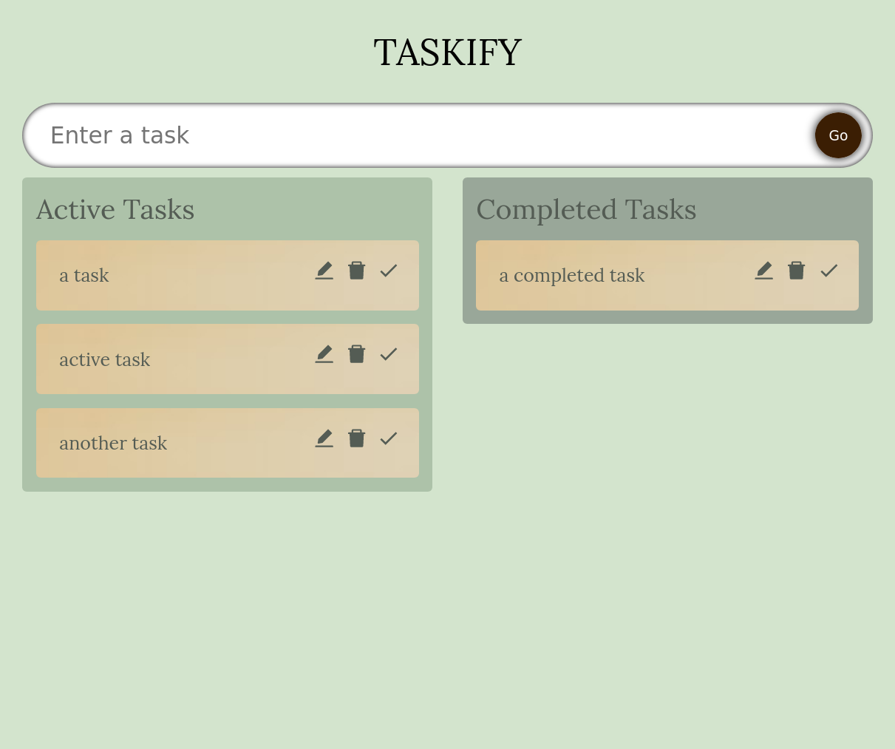

# Taskify

Taskify is a small browser to-do app. This project shows the capabilities of react, typescript and react-beautiful-dnd. The items are drag and droppable.

This project was bootstrapped with [Create React App](https://github.com/facebook/create-react-app).

The icons come from here:
react-icons.github.io/

react-beautiful-dnd from here:
https://github.com/atlassian/react-beautiful-dnd

I got the color palette from here:
https://colorhunt.co/palette/fef5edd3e4cdadc2a999a799

## Available Scripts

In the project directory, you can run:


### `yarn start`

``` bash
Compiled successfully!

You can now view my-app in the browser.

  Local:            http://localhost:3000
  On Your Network:  http://192.168.1.104:3000

Note that the development build is not optimized.
To create a production build, use yarn build.

webpack compiled successfully
No issues found.
```

### `Demo`




